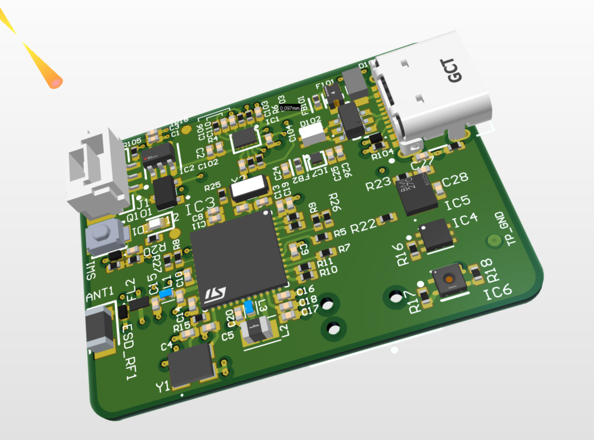

# BLE-Control — Low-Power BLE Sensor Platform

I designed BLE-Control as a compact, battery-powered BLE sensor platform based on the **STM32WB55**. The project combines USB-C charging, Li-Po power management, low-power regulation, motion and environmental sensing, and Bluetooth Low Energy communications on a compact 4-layer PCB.

My focus was on the complete embedded hardware architecture, including power management, sensor integration, RF/BLE considerations, PCB layout, debugging access and hardware/firmware integration.

## PCB Render

  

---

## Project Overview

BLE-Control brings together three main functional areas:

**Power & Charging → STM32WB55 / BLE → Sensors & I/O**

The design was developed around low-power battery operation, with separate system and switched sensor power domains. The sensor rail can be disabled by the MCU when measurements are not required, reducing unnecessary power consumption.

The STM32WB55 provides the main embedded processing and Bluetooth Low Energy functionality, while the sensor subsystem provides motion, temperature and environmental measurements.

---

## Design Highlights

* STM32WB55 MCU with integrated Bluetooth Low Energy
* USB-C power and charging interface
* Li-Po battery charging and power-path management
* Low-quiescent-current 3.3 V system supply
* MCU-controlled sensor power rail
* BMI270 inertial measurement unit
* TMP117 precision temperature sensor
* SHTC3 humidity and temperature sensor
* BLE antenna matching network
* USB protection and ESD components
* Tag-Connect SWD programming/debug interface
* 4-layer PCB designed in Altium Designer
* STM32CubeIDE development environment
* Hardware bring-up and test planning

---

# System Architecture

BLE-Control contains three main engineering domains.

## 1. Power / Charging / USB-C

The power architecture is designed around USB-C input and Li-Po battery operation.

Key components include:

* **BQ21061** battery charger and power-path controller
* Reverse-battery protection
* **TPS7A02-3.3** low-quiescent-current regulator for `+3V3_SYS`
* **TPS22910A** load switch providing the gated `3V3_SENS` sensor rail
* USB-C input protection

The USB interface includes:

* PPTC protection
* VBUS TVS protection
* CC-line ESD protection
* USBLC6 protection
* Common-mode choke
* Shield bleed network

The separate `3V3_SENS` rail allows the MCU to remove power from the sensors when they are not required.

---

## 2. MCU + BLE

The design is based on the **STM32WB55**, combining the main embedded processor and Bluetooth Low Energy radio.

The MCU section includes:

* STM32WB55 dual-core wireless MCU
* Bluetooth Low Energy
* USB Full Speed
* 32 MHz HSE
* 32.768 kHz LSE
* STM32WB internal SMPS support
* RF matching network
* Chip antenna
* SWD programming/debug through Tag-Connect

The RF output is routed through the external matching/filter network before reaching the antenna.

---

## 3. Sensors + I/O

The sensor subsystem includes:

* **BMI270** — inertial measurement unit
* **TMP117** — precision temperature sensor
* **SHTC3** — humidity and temperature sensor

The sensors operate from the switched `3V3_SENS` rail and communicate with the STM32WB55 over I²C.

Additional I/O includes:

* User button
* LED status indication
* Debug/programming interface
* Test points for hardware bring-up

---

# Power Architecture

Power management was an important part of the design.

The basic power path is:

**USB-C / Li-Po → BQ21061 → TPS7A02 → +3V3_SYS**

with a separately controlled sensor supply:

**+3V3_SYS → TPS22910A → 3V3_SENS**

This allows the STM32WB55 to remain operational while the sensor subsystem is powered down when it is not needed.

The design therefore combines battery charging, system regulation and load switching rather than powering all circuitry continuously from a single rail.

---

# PCB Design

I developed the PCB in **Altium Designer 25** as a compact 4-layer embedded design.

The layout work considered:

* Power-path placement
* Charger and regulator current loops
* STM32WB55 decoupling
* RF component placement
* Antenna region
* USB differential routing
* ESD return paths
* Sensor placement
* Ground return paths
* Programming/debug access
* Test-point accessibility

The PCB layout and schematic source are included in the repository for further inspection.

---

# Hardware

→ **[`Hardware/Altium/`](Hardware/Altium/)**

The hardware directory contains the Altium design material, including:

* Project files
* Schematic
* PCB layout
* Output configuration
* Supporting component/library information

---

# Firmware

→ **[`Firmware/`](Firmware/)**

The firmware area contains STM32WB55 development material based around **STM32CubeIDE**.

The embedded development environment provides the basis for:

* Board bring-up
* GPIO control
* Sensor power control
* I²C sensor communication
* BLE development
* Debugging and programming

---

# Hardware Bring-Up Strategy

I developed the following staged bring-up approach for the board.

## 1. Verify Power Path and Rails

Power the board from USB-C or a current-limited bench supply and verify:

* `VBUS`
* `VBAT_RAW`
* `VBAT_PROT`
* `PMID`
* `+3V3_SYS`

Check startup behaviour, current consumption, rail stability and ripple before programming the MCU.

## 2. STM32WB55 Bring-Up

Program the STM32WB55 through the Tag-Connect SWD interface.

Initial firmware can be kept deliberately simple to establish:

* MCU programming
* Clock operation
* GPIO
* LED control
* Basic debugging

## 3. Charger Verification

Verify BQ21061 operation including:

* USB attachment
* Battery charging
* Charge-state transitions
* Interrupt/status behaviour

## 4. Sensor Rail Bring-Up

Assert `SENS_EN` and verify operation of the TPS22910A switched sensor supply.

Confirm `3V3_SENS` and establish I²C communication with:

* TMP117
* BMI270
* SHTC3

## 5. Power Measurements

Measure the main power rails under representative operating conditions.

Areas of interest include:

* Startup behaviour
* Regulator ripple
* Sensor rail switching
* Active current
* Low-power current

## 6. BLE / RF Bring-Up

Once the basic digital and power systems are operational, bring up the BLE interface and evaluate:

* BLE advertising
* Connection stability
* RSSI
* Packet Error Rate
* Antenna matching
* RF performance across representative orientations and distances

---

# Engineering Verification

The design includes provision for structured bench verification rather than relying only on schematic and PCB review.

Areas I would verify during bring-up include:

### Power

* USB-C input behaviour
* Battery charging
* System rail regulation
* Sensor rail switching
* Startup/inrush
* Ripple
* Current consumption

### Digital

* STM32WB55 programming
* Clock operation
* Reset behaviour
* GPIO
* I²C communications
* Sensor identification and data acquisition

### BLE / RF

* Advertising and connection
* RSSI
* Packet Error Rate
* Antenna matching
* Harmonic behaviour

### Robustness

* USB ESD behaviour
* Power cycling
* Brownout behaviour
* Repeated sensor power cycling
* Extended operation

---

# Project Status

The repository documents the hardware architecture, schematic, PCB design and supporting embedded-development material for BLE-Control.

The project should be regarded as a **development and portfolio platform rather than a qualified production product**. Hardware bring-up, RF characterisation and extended verification remain separate from the design work documented here.

---

# Quick Navigation

### Hardware Design

→ **[`Hardware/Altium/`](Hardware/Altium/)**

Altium schematic, PCB and supporting hardware-design material.

### Firmware

→ **[`Firmware/`](Firmware/)**

STM32CubeIDE project and embedded-development material.

### Documentation

→ **[`Docs/`](Docs/)**

Design notes, schematic information, BOM and supporting engineering documentation.

---

# Tools Used

**Hardware Design**

* Altium Designer 25

**Embedded Development**

* STM32CubeIDE
* STM32CubeProgrammer
* STM32CubeMonitor-RF

**Analysis**

* LTspice
* Python

**Development**

* Git / GitHub

---

# What This Project Demonstrates

BLE-Control demonstrates my approach to developing a compact battery-powered embedded product that combines:

**power management + embedded hardware + BLE + sensors + PCB design + hardware/firmware integration**

The emphasis is on designing the individual subsystems as parts of a complete product architecture: managing battery power, controlling sensor consumption, integrating the STM32WB55 and BLE radio, providing practical debugging access and planning the hardware bring-up needed to move from PCB design to a working embedded system.

